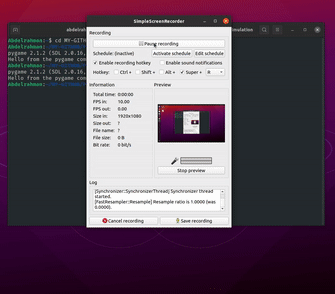

# Planet-Simulation

#### Python App that simulates the movement of planets around the sun with pygame module.

#### The app applies the gravitational force laws between planets and detect its orbit.

#### The app simulates the first four planets in the solar system.

